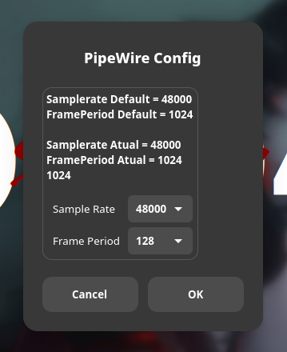

# nickgirga/pipewire-config
[pipewire-config](https://github.com/xivastudio/pipewire-config) is a project originally created by [XIVA Studio](https://github.com/xivastudio) in an effort to make configuring [pipewire](https://www.pipewire.org/) a bit easier, using [Zenity](https://gitlab.gnome.org/GNOME/zenity) GUI elements. It's a basic bash script that asks zenity to present you with the right options to configure your install of pipewire.



### install.sh vs install_local.sh
Which installer should you chose?

#### install.sh
[`install.sh`](install.sh) is the original installer, intended to install the app in the `/usr` directory. System files. This requires super user permissions (sudo). This has been the traditional paradigm for installing software on Linux for decades. Many of you may prefer this soley due to familiarity.

#### install_local.sh
[`install_local.sh`](install_local.sh) is the modified installer, intended to install the app in the `$HOME/.local` prefix. User files. This does not require any super user permissions. However, it won't work as well system-wide (e.g. on another user's account). This is becoming a more desirable paradigm for users that prefer immutable systems like Fedora Atomic (Silverblue/Kionite) or SteamOS. It will be less intrusive on the system, can be easily removed, backed up, and modified. It's a bit more portable. This is my ([nickgirga](https://github.com/nickgirga)'s) personal preference and the main reason this fork even exists.

### Obtaining
#### Download a Release (Stable) - GUI
Download a release of the software in the [releases](https://github.com/nickgirga/pipewire-config/releases) section. It's just a simple bash script, nothing needs to be compiled/built, so you can just grab the source code. Grabbing the latest version is probably the wisest idea.

or

#### Clone with Git (Development) - Terminal
If you would prefer to have a directory that has version control, tracked by git, you can clone the repository wherever you would like:
```
git clone https://github.com/nickgirga/pipewire-config.git
```
Keep in mind that the git version is a live copy of the master branch. This means that you may have pulled potentially incomplete changes that may not function properly. If you are experiencing issues, please try using a stable, versioned release.

### Installation
First, [obtain the software](#Obtaining). Then, proceed with one of the following options:
#### Dolphin File Browser (KDE Plasma) - GUI
If you have downloaded an archive (e.g. `.zip`, `.tar.gz`), locate the downloaded file in the Dolphin file browser, right click it, and click "Extract" > "Extract here and delete archive" in the context menu. Then go inside of the extracted folder. If you have cloned the repository with git, simply locate the cloned folder. Once you are in the folder, right click on one of the install scripts ([`install.sh`](#installsh) or [`install_local.sh`](#install_localsh)), and click on "Run In Konsole". Wait until it completes. You're done! (But [which installer should I choose?](#installsh-vs-install_localsh))

or

#### Terminal
If you have downloaded an archive (e.g. `.zip`, `.tar.gz`), locate the downloaded file using `cd <folder>` to navigate and `ls` to inspect the contents of the current directory. Once the archive is in your current directory, decompress it with the appropriate tool (e.g. `unzip <archive_name>.zip` or `tar -xvf <archive_name>.tar.gz`). Then, navigate inside of the extracted folder. If you have cloned the repository with git, simply naviate inside of the cloned folder. Once you are in the folder, just run one of the install scripts (e.g. [`./install.sh`](#installsh) or [`./install_local.sh`](#install_localsh)). Wait until it completes. You're done! (But [which installer should I choose?](#installsh-vs-install_localsh))

### Usage
After [installing](#installation) the software, you should be able to find an application shortcut called "PipeWire Config" in your application launcher. Your system may need to update its desktop (shortcut) database. Give it a minute, maybe log out and log in, or try running `update-desktop-database` if it isn't showing up.

Then, just launch it, choose your settings and click either "Cancel" or "OK". Done. PipeWire configured.

### Why does this repository exist?

For a few reasons. The biggest being the fact that I use [Fedora Kionite](https://fedoraproject.org/atomic-desktops/kinoite/). This is a release of [Fedora](https://fedoraproject.org/) that utilizes [rpm-ostree](https://coreos.github.io/rpm-ostree/) technology to deliver updates in images that should not be modified (that can then be layered over if needed). The idea is that you install almost all of your user apps in... you know... the user space. Usually Flatpaks or AppImages. The system files aren't supposed to be touched unless you really need to change system things (in which case, you should prefer to either build a proper RPM package to overlay, or manually overlay your own directory using fstab mounts). Now, while pipewire-config is a system-oriented app, it's also simple enough and requires few enough permissions to live in the user space. So... writing a local installer script is much, much simpler than creating and testing a reliable and reproducable RPM build. It also makes it easier to audit the authenticity of the source, in the event that somebody wants to make sure what they are installing is actually the code from the repository. Distributing an RPM adds a layer of obscurity that may turn some people away because they don't trust that "random RPM from GitHub". So, I settled on modifying the original install script to install to the `$HOME/.local/` prefix.

There is also the matter of translation. The original pipewire-config application has some Portuguese in it. I speak English. And while it is possible to implement dynamic translations using your system language settings in a bash script, using Zenity, it's not something that warrants investing my time into learning and implementing, as this just becomes another dependency that this otherwise simple script would need in order to run. The simpler solution is to just maintain my own English fork of the software.